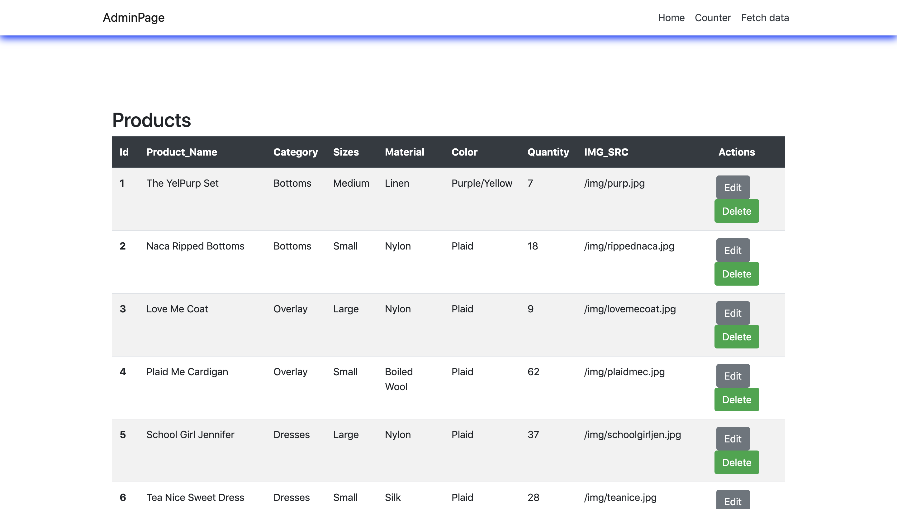
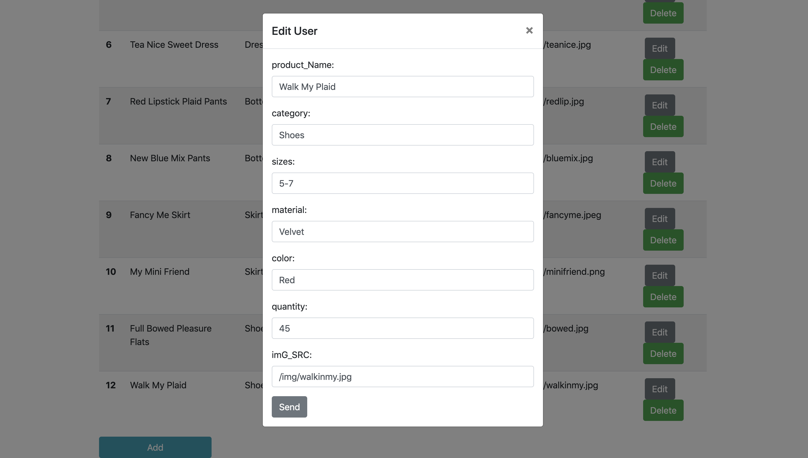
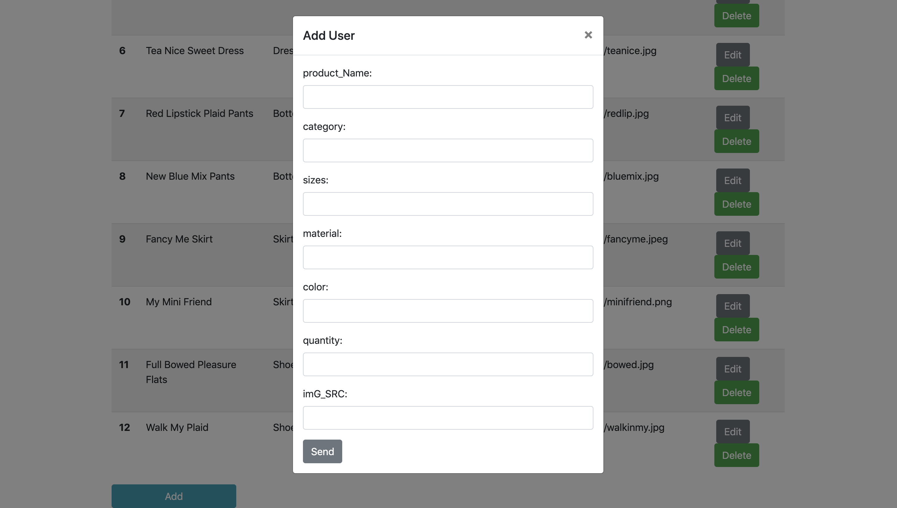
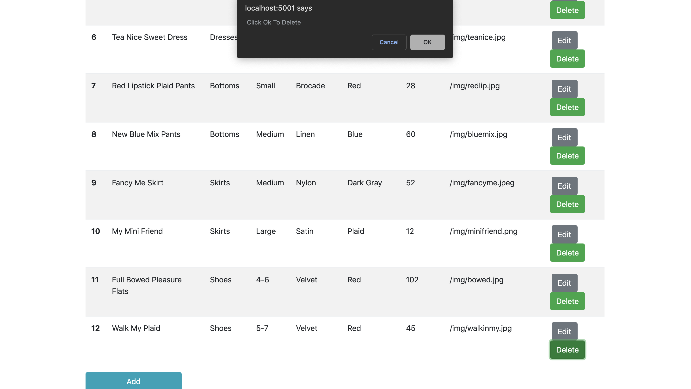

# Project4-CSharp

This App was made to request products from the connected MySQl Database and ability to make changes to the products.

## Visuals

### Read

### Update

### Create

### Delete

## Installation 
 For this Project the following were used, C#, MySQL, ReactJS
 To Implement: Bootstrap 

## Usage
 Expected Outlook

## Project Status
This project will be making future updates to design. 

## License
[MIT](https://choosealicense.com/licenses/mit/)

